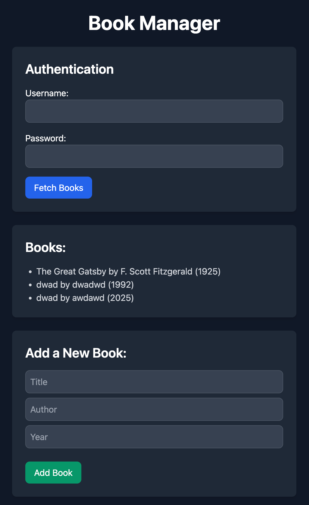

# Learning Python / Flask

I'm learning Python / Flask by building a simple CRUD application.

Technologies used:

- Python
- Flask
- SQLite
- HTML
- Tailwind CSS

# How to run

1. Open the terminal
2. Run `export FLASK_APP=app.py`
3. Run `flask run` or `python app.py`

# How to view

1. Open the browser
2. Go to `http://127.0.0.1:5000/books`

OR

1. Open a new terminal
2. Run `curl http://127.0.0.1:5000/books`

# How to add a new book

1. Open a new terminal
2. Run `curl -u admin:123 -X POST http://127.0.0.1:5000/books -H "Content-Type: application/json" -d '{"title": "The Great Gatsby", "author": "F. Scott Fitzgerald", "year": 1925}'`

# How to get a book

1. Open a new terminal
2. Run `curl http://127.0.0.1:5000/books/1`

# How to update a book

1. Open a new terminal
2. Run `curl -u admin:123 -X PUT http://127.0.0.1:5000/books/1 -H "Content-Type: application/json" -d '{"title": "The Great Gatsby", "author": "F. Scott Fitzgerald", "year": 1925}'`

# How to delete a book

1. Open a new terminal
2. Run `curl -u admin:123 -X DELETE http://127.0.0.1:5000/books/1`
